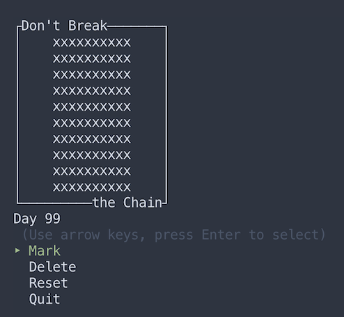

# Don't Break the Chain!

[Don't Break the Chain!](https://github.com/elloo/terminal_app/commits/master "GitHub repository") is a Ruby terminal application for tracking daily progress of [#100DaysOfCode](https://www.100daysofcode.com/).

## Functionality

This application comes with four simple commands:

1. Mark - creates "x" marks within the interface.
2. Delete - deletes "x" marks created in the same day.
3. Reset - clears the interface of all "x" marks.
4. Quit - exits the program.

This application was designed to track habitual behaviour over the period of 100 days. It allows for breaks in the "chain" and must be manually reset to re-initialise the starting date.

## Instructions for Use

Within the Command Line Interface (CLI):

1. Navigate to the containing folder using `cd`
2. Open the `src` folder
3. Type `ruby index.rb` into the CLI
4. Follow the on-screen prompt

### Gems used

- [TTY::Prompt](https://github.com/piotrmurach/tty-prompt "TTY::Prompt GitHub")
- [TTY::Box](https://github.com/piotrmurach/tty-box "TTY::Box GitHub")

## Screenshots

## Brainstorming and Workflow

In the initial brainstorming phase, these [notes](docs/brainstorm.pdf) were created. This is a list of the five different ideas that were generated within an hour. The possibilities included:

1. A mood tracker
2. Don't Break the Chain
3. Space Invaders
4. Bejeweled
5. A translation app

It was decided that agile methodology would be followed as it would be hard to accurately judge how long each feature would take to implement. [Communication](docs/communication.png "Slack communication") was done in-person and over Slack.

The [user flow](docs/notes_and_user_flow.pdf "notes and user flow sketch") was sketched out to give a rough idea of how users would navigate around the application. 

After the application was coded, it underwent several manual tests. The results can be found [here](docs/manual_testing.pdf)

## Initial Design Specifications

The project was first intended to be a Create, Read, Update, Delete (CRUD) application. After the first sprint, it was decided that updating or editing the application was not needed on moral grounds. 

### User Stories

The following user stories reflect the initial design specifications of this application.

- (High priority) As Ewe Lin, I want to mark down the days I stick to a habit so that I can track my progress in #100DaysofCode
- (High priority) As Ewe Lin, I want to be able to view all entries so that I can gain an overview of my past behaviour
- (Medium priority) As Ewe Lin, I want to be able to delete past entries so that I can make mistakes
- (Low priority) As Ewe Lin, I want to be able to change / update entries for previous days so that I can make marks irregularly.

## Project Plan & Timeline

**First sprint** 

After some advice from the teacher, Don't Break the Chain was selected as the project to work on. Related gems were noted beforehand and they were immediately used to create the menu and box containing the grid. All basic functionality (`mark`, `delete` and `reset`) and writing / reading from a file were coded. This took approximately 13 hours. Unfortunately, this meant overlooking the planning phase for the higher-level structure. 

**Second sprint**

The UI of the application was sketched out. In addition, notes were made on how to improve the reset function and implement the day tracking feature. Changes were made to the structure of the code to reflect this sketch. A `quit` feature was also coded into the program, along with strategic use of `system "clear"`.

**Third sprint**

The higher-level structure was implemented. Luckily, due to the organisation of the code it was mostly a copy-and-paste type of operation. Also in this sprint was the debugging and testing. This took about 24 hours as some bugs were tricky to fix. Particularly memorable was a digit-swapping bug that would occur every time the application was closed and re-opened. This was solved with the help of the teacher.

### Higher Level Structure

This application holds two separate files from the main `index.rb` file. These are the `helpers.rb` file and `ui.rb` file. A module was used for `helpers.rb` as a means to share functionality with `index.rb` and `ui.rb`. A class was used in `ui.rb` as it had a couple of methods that needed to be executed on creating an instance. In addition, there were some instance variables that need to be initialized.

The `helpers.rb` file contains a module with methods that occur behind-the-scenes. This includes `fixed_array` for creating an array with ten blank elements. This array is used in `reset` for creating a 2D array. Another method included in the `Helpers` module is `track_day`. This is used to keep count of the number of days that have passed since the last reset of the app. The last two methods that are a part of `helpers.rb` are `read_file` and `write_file`. These methods are used for saving the user input for future sessions.

The `ui.rb` file contains a `Menu` class. This contains all the methods that control the user interface of the application. It is initialized with an empty array `@grid` and an instance variable called `@day_index`. It also calls the `track_day` and `menu` methods on starting up. Other than `initialize`, this file contains the `menu` for displaying the UI, and the `mark` and `reset` methods, for adding and deleting the "x" marks as well as resetting the UI.

### Trello Screenshots

- [Main](docs/main.png "Full screenshot")
- [Lower-half of done list](docs/done_lower_half.png "Lower half of done list")
- [Colour key](docs/key.png "Colour key")

## Technical Difficulties

1. Writing and reading the file

   One of the first difficulties encountered was learning to write and read from a file properly. It took about 6 hours to solve this.
   
   From a suggestion for a previous class exercise, it was thought that YAML would be sufficient. However, this was corrected and a normal .txt file was used instead. This made things much more straightforward as YAML uses special structures for it's format whereas .txt files retain the familiar Ruby syntax.

   In order to add or delete a single, selected character within the 2D array that represented the grid, the file always had to be read directly before making a change to it.

   Another problem that occurred with writing the file was that it would append to the file when trying to reset, even though it was in write mode. This was due to the use of `<<` within the `reset` method. It was easily fixed by assigning an empty array at the start of the method. 

2. Implementing the day tracker

    The second main difficulty was implementing the day tracker. There were a few reasons for this.

    Firstly, it was important to know that `File.open` is a command that returns what is in the block. When used in conjunction with `.write` it returns the length of the file data. This also meant that the date could not be directly read from the file. Instead, we had to use the `.birthtime` method to save the time that the file was created.

    This led to the next problem as it took a while to notice that `Time.now` had to be used to calculate the difference in days instead of `Date.today`. 

    The last issue with the day tracker was getting both single- and double-digits numbers to work. Initially, both `format` and defaulting the first digit to 0 was used. This resulted in the double-digits of numbers being switched every time the application was closed and re-opened. It was fixed by simply relying on the `format` method to address the issue.

## Future Improvements

1. Add colours to signify effort

   This can be done using the [Colorize](https://github.com/fazibear/colorize "Colorize GitHub") gem. It was intended that users would be able to use warmer colours to indicate high amounts of effort put into coding while cooler colours would represent the opposite.

   Another improvement on this would be to allow users to set their own colours.

2. Add a reward (a rainbow effect on the marks) for completing 100 days

   This can be done using the [lolcat](https://github.com/busyloop/lolcat "lolcat GitHub") gem.

2. Language translation

   This would address the minor cultural bias towards users from English-speaking backgrounds.

## Discussion

### Legal, moral, ethical, cultural and safety issues

It is important to note that this application was only inspired by and NOT directly affiliated in any way with [#100DaysofCode](https://100daysofcode.com "100 Days of Code").

This application was initially intended to allow the user to edit marks on any given day. On further consideration of the morality behind this function, it was decided that this feature be omitted from the application. This would prevent the user from falsifying earlier entries and enhance the authenticity of data.

Use of this application may cause disappointment and frustration. Potential users are encouraged to be of sound mental health before using the application.

### Social, political, cultural, racial, gender and international issues

[#100DaysofCode](https://100daysofcode.com "100 Days of Code") is a social campaign that encourages those people to code for 100 days in a row. Whilst the campaign encourages people to use Twitter as a means for recording their progress, this application provides a private way to do so.

The application relies on a few words ("Mark", "Delete", and "Reset") with functionality that can easily be discovered or translated. This is to minimise the non-intentional bias toward English-speaking cultures and races.
